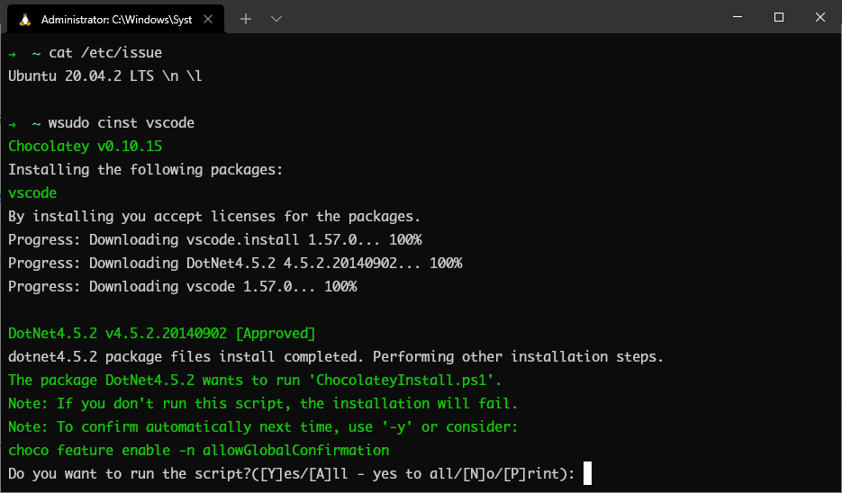

# Windows `sudo` wrapper for WSL
The WSL has the ability to run various PowerShell commands. However, these commands can only be run without administrator privileges. My little wrapper fixes this and allows you to run PowerShell commands as an administrator without leaving WSL. 

**To run wrapper, you need to install psutils in chocolatey.**

# Example

For example, you can use this to install/uninstall/upgrade chocolatey packages without leaving WSL shell:

